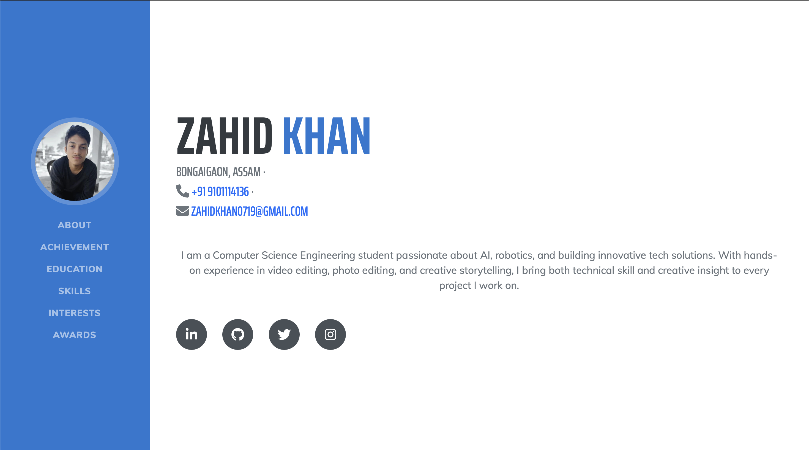

<div align="center">

# 👋 Hi, I'm Zahid Khan

### Robotics Engineer • AI Enthusiast • Full Stack Learner • Content Creator

*"Building robots. Building software. Building myself."*


<br>

[][(https://YOUR-PORTFOLIO-LINK)](https://superlative-squirrel-c8f581.netlify.app/#page-top)
[](https://linkedin.com/in/zahid-khan-116488322)
[](https://github.com/zahidkh1)

</div>

---

# 📖 Overview

This repository contains the complete source code of my personal portfolio website.

The portfolio serves as a central platform where I present my technical background, engineering projects, certifications, achievements, creative work, and ongoing learning journey.

Rather than being just an online résumé, this website represents my evolution as a Computer Science Engineering student specializing in Robotics and Artificial Intelligence.

It reflects my passion for building intelligent systems, modern web applications, embedded solutions, and continuously improving through hands-on projects.

---

# 🎯 Purpose

The primary objective of this portfolio is to create a professional digital identity that enables recruiters, collaborators, and fellow developers to explore my work in a structured and engaging manner.

It also serves as a living archive that will continue to evolve with every new project, certification, research idea, and technical milestone.

---

# ✨ Features

- 👨‍💻 Professional Portfolio
- 🤖 Robotics & AI Projects
- 🏆 Certifications & Achievements
- 🎓 Academic Timeline
- 💡 Technical Skills
- 📂 Project Showcase
- 🎬 Creative Editing Portfolio
- 📱 Fully Responsive Design
- ⚡ Smooth Navigation
- 🌙 Modern UI
- 🔗 Professional Social Links
- 📄 Resume Integration

---

# 🛠 Technology Stack

| Category | Technologies |
|-----------|--------------|
| Frontend | HTML5, CSS3, JavaScript |
| Framework | Bootstrap 5 |
| Icons | Font Awesome |
| Typography | Google Fonts |
| Version Control | Git |
| Hosting | GitHub Pages |

---

# 📂 Portfolio Sections

- 👋 About Me
- 🏆 Achievements
- 🎓 Education
- 💻 Skills
- 🚀 Projects
- ❤️ Interests
- 📜 Awards & Certifications
- 📬 Contact
- 🌐 Professional Profiles

---

# 🚀 Current Goals

- Build intelligent robotics systems
- Develop AI-powered applications
- Learn Full Stack Development
- Contribute to Open Source
- Publish impactful engineering projects
- Grow **Living Prototype** as a technology and content platform

---

# 📈 Development Roadmap

### Completed

- Responsive Portfolio Design
- Bootstrap Integration
- GitHub Deployment
- Professional UI Layout
- Certification Showcase

### In Progress

- Dark Mode
- Interactive Project Cards
- Animated Skill Graphs
- GitHub Contribution Graph
- Project Filtering
- Better Performance Optimization

### Future Plans

- AI Project Gallery
- Robotics Research Section
- Technical Blog
- Interactive Resume
- Live Project Demonstrations
- Case Studies
- Research Publications

---

# 📸 Preview

> Portfolio homepage





---

# 📁 Repository Structure

```text
portfolio/
│
├── image/
│   └── logo.jpeg
│   └── portfolio-preview.png
│
├── index.html
├── style.css
├── script.js
└── README.md
```

---

# 💡 Design Philosophy

This portfolio follows a clean and minimal design philosophy inspired by modern engineering websites.

The emphasis is placed on readability, accessibility, responsiveness, and maintainability while providing a professional user experience across desktop and mobile devices.

---

# 📊 Project Status

| Feature | Status |
|----------|--------|
| Portfolio Website | ✅ Completed |
| Responsive Layout | ✅ Completed |
| Bootstrap Integration | ✅ Completed |
| GitHub Pages Deployment | ✅ Completed |
| Interactive Animations | 🚧 In Progress |
| Project Showcase | 🚧 Expanding |
| Technical Blog | 📅 Planned |

---

# 🤝 Contributions

Although this repository primarily serves as my personal portfolio, constructive suggestions regarding design, accessibility, performance, and code quality are always welcome.

If you discover any issues or have recommendations for improvement, feel free to open an Issue or submit a Pull Request.

---

# 📬 Connect With Me

<div align="center">

<a href="mailto:zahidkhan0719@gmail.com">

</a>

<a href="https://github.com/zahidkh1">

</a>

<a href="https://www.linkedin.com/in/zahid-khan-116488322">

</a>

<a href="https://x.com/jueel_19">

</a>

<a href="https://www.instagram.com/khn_zahid_18/">

</a>

<a href="https://www.youtube.com/@LivingPrototype">

</a>

<a href="https://superlative-squirrel-c8f581.netlify.app/#page-top">

</a>

</div>
---

<div align="center">

### ⭐ If you found this project interesting, consider giving it a star.

*"Every great engineer starts with curiosity."*

Made with ❤️ by **Zahid Khan**

</div>
